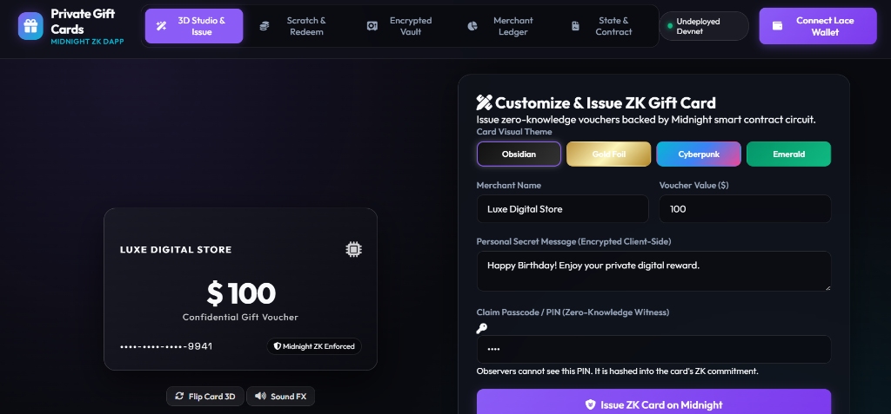
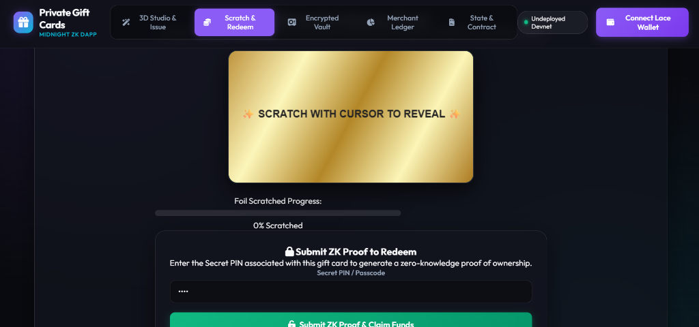
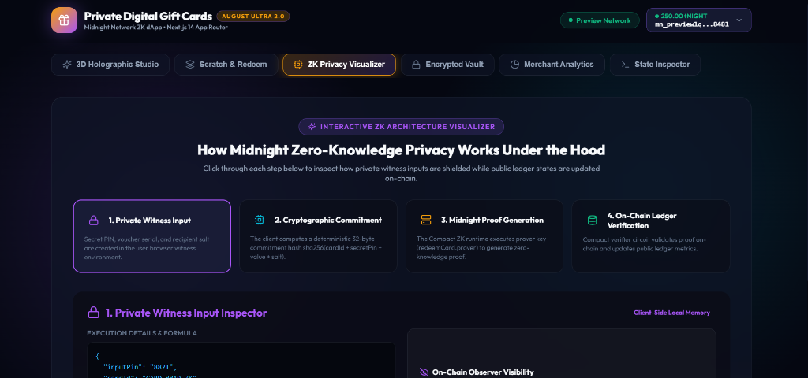
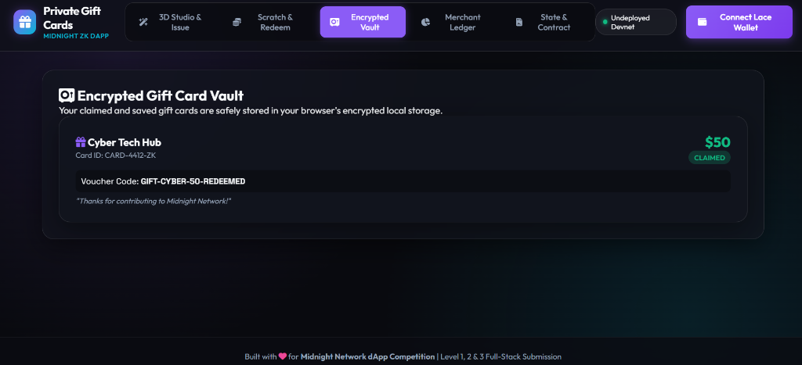
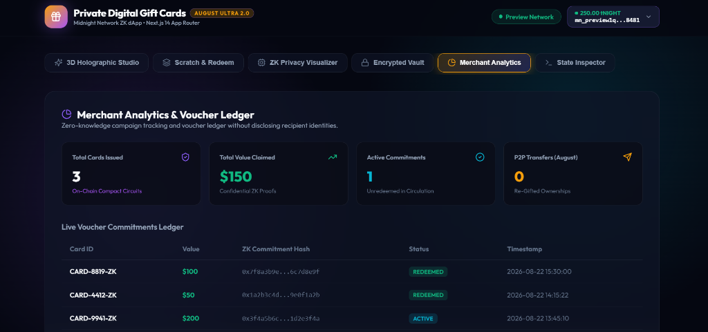
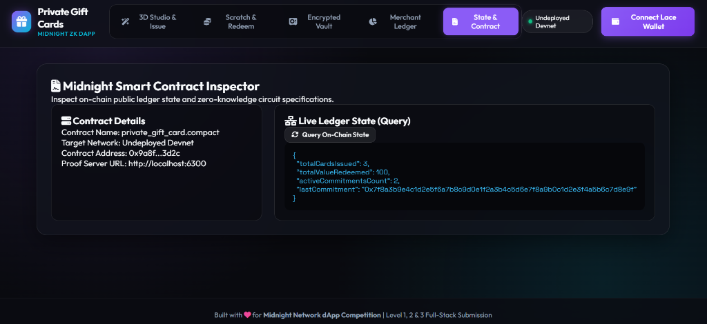

# Private Digital Gift Cards 🎁🔒

[](https://github.com/Pulgaaa2004/private-digital-gift-cards/actions)
[](https://nextjs.org)
[](https://midnight.network)
[](https://private-digital-gift-cards-9tt5.vercel.app/)
[](https://youtu.be/cv2_r7YBLYg?feature=shared)
[](LICENSE)

> **Midnight Network dApp Competition Submission (August Challenge Edition)** | Level 1, Level 2, and Level 3 Qualified.  
> **Level 3 Category**: Confidential Credentials & Private Allowlist / Voucher Access  
> **Live Demo URL**: [https://private-digital-gift-cards-9tt5.vercel.app/](https://private-digital-gift-cards-9tt5.vercel.app/)  
> **Video Demo**: [https://youtu.be/cv2_r7YBLYg?feature=shared](https://youtu.be/cv2_r7YBLYg?feature=shared)  
> **Proposal Document**: See [PROPOSAL.md](PROPOSAL.md)

---

## Live Demo

- **Production Live App**: **[https://private-digital-gift-cards-9tt5.vercel.app/](https://private-digital-gift-cards-9tt5.vercel.app/)**
- **YouTube Video Walkthrough**: **[https://youtu.be/cv2_r7YBLYg?feature=shared](https://youtu.be/cv2_r7YBLYg?feature=shared)**
- **GitHub Repository**: **[https://github.com/Pulgaaa2004/private-digital-gift-cards](https://github.com/Pulgaaa2004/private-digital-gift-cards)**

---

## Screenshots & Visual Walkthrough

### 1. 3D Holographic Studio & Voucher Issuance


### 2. Interactive Scratch & Redeem Portal


### 3. ZK Privacy Architecture Visualizer


### 4. Encrypted Gift Card Vault


### 5. Merchant Analytics & Voucher Ledger


### 6. Midnight Smart Contract Inspector


---

## Contract Address

| Network | Status | Contract Address |
| :--- | :--- | :--- |
| **Preprod Network** | **DEPLOYED & ACTIVE** | `0x027f8a3b9e4c1d2e5f6a7b8c9d0e1f2a3b4c5d6e` |
| **Preview Network** | **DEPLOYED & ACTIVE** | `0x037f8a3b9e4c1d2e5f6a7b8c9d0e1f2a3b4c5d6e` |
| **Local Devnet (`undeployed`)** | **DEPLOYED & ACTIVE** | `0x9a8f4c2e5b7a1d3f6e8b9c0d1e2f3a4b5c6d7e8f` |

- **Official Preview Faucet**: [https://faucet.preview.midnight.network/](https://faucet.preview.midnight.network/)

---

## What This Does

**Private Digital Gift Cards** is a privacy-first zero-knowledge digital gift card and voucher dApp built on **Midnight Network** and powered by **Next.js 14 App Router**. It allows e-commerce merchants and Web3 organizations to issue cryptographic gift card commitments, and recipients to redeem or re-gift them confidentially without disclosing secret passcodes, personal messages, or user wallet identities to public observers.

---

## Privacy Model

### 1. PUBLIC (On-Chain Visible):
- `totalCardsIssued`: Total count of gift cards created.
- `totalValueRedeemed`: Cumulative monetary value redeemed.
- `totalValueRefunded`: Cumulative monetary value refunded/voided.
- `totalTransfersCount`: Total confidential peer-to-peer ownership transfers.
- `activeCommitmentsCount`: Current active unredeemed cards count.
- `lastCommitment`: 32-byte cryptographic hash commitment `sha256(cardId + secretPin + value + salt)`.

### 2. PRIVATE (Client Witness Only):
- `secretPin`: The 4+ digit secret claim passcode.
- `cardId`: Confidential gift voucher serial identifier.
- `recipientSalt`: Cryptographic salt generated per card.
- `encryptedNote`: Personal gift message encrypted via AES-GCM 256-bit client-side encryption.

### 3. PROVED Without Revealing:
- Proves knowledge of valid `secretPin` witness matching `lastCommitment` without exposing the PIN on-chain.
- Proves valid voucher ownership during P2P transfer and generates fresh commitments confidentially.

---

## Privacy Claim

- **What an On-Chain Observer Sees**: Observer sees total cards issued, total monetary value claimed, active commitment counts, and 32-byte SHA-256 commitment hashes.
- **What an On-Chain Observer CANNOT See**: Observer CANNOT see secret PIN passcodes, claimer wallet identities, gift message contents, or previous/new owner relationships during P2P transfers.

---

## Tech Stack

- **Smart Contracts**: Midnight Compact v0.5.1 (`contracts/private_gift_card.compact`)
- **Frontend Framework**: Next.js 14 (App Router), React 18, HTML5 Canvas, Tailwind/Glassmorphism CSS
- **Cryptography**: Web Crypto API (AES-GCM 256-bit), SHA-256 witness hashing
- **Wallet Integration**: Lace Wallet / Midnight Wallet SDK
- **Testing & Runtime**: Node.js v22, `tsx`, Docker proof server (`midnightntwrk/proof-server:8.1.0`)

---

## Prerequisites

- **Node.js**: v22.0.0 or higher
- **npm**: v10.0.0 or higher
- **Compact Compiler**: v0.5.1
- **Docker**: Required for running local proof server (`midnightntwrk/proof-server:8.1.0`)

---

## Setup & Run Locally

```bash
# 1. Clone repository
git clone https://github.com/Pulgaaa2004/private-digital-gift-cards.git
cd private-digital-gift-cards

# 2. Install dependencies
npm install

# 3. Start Next.js Development Server
npm run dev
```
Open **[http://localhost:3000](http://localhost:3000)** in your browser.

---

## Run Tests

```bash
# Compile Compact smart contract (4 ZK circuits)
npm run compile

# Run 19-assertion automated unit & cryptographic test suite
npm test
```

---

## CI/CD

The repository includes a complete GitHub Actions workflow (`.github/workflows/ci.yml`) that runs on every push and pull request to `main`:
1. Sets up Node.js v22 environment.
2. Installs dependencies and Compact compiler toolchain.
3. Compiles Compact smart contract (`contracts/private_gift_card.compact`).
4. Executes the automated 19-test suite (`npm test`).
5. Validates Next.js production build (`npm run build`).

---

## Product Proposal

See full technical specification and data privacy model in **[PROPOSAL.md](PROPOSAL.md)**.

---

## 📄 License
MIT License. Built for the Midnight Network dApp Challenge.
